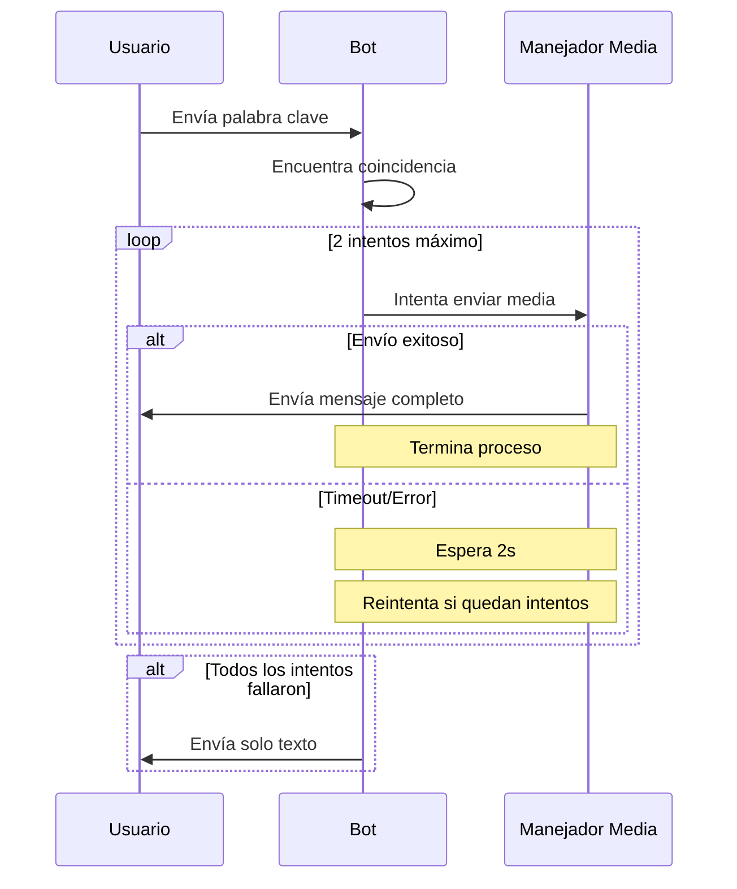

# Plan de Corrección para el Manejo de Medios en Flujo Dinámico

## Problema Identificado
Actualmente, cuando un contacto escribe una palabra clave coincidente, el sistema ocasionalmente envía dos mensajes:
1. Primero envía el texto y la URL
2. Luego envía el mensaje completo con multimedia integrado

Este comportamiento se debe a:
- Timeout muy corto (5 segundos) en la validación de medios
- Manejo subóptimo de errores que causa reenvíos
- Falta de sistema de reintentos

## Solución Propuesta

### 1. Ajustes de Timeouts y Reintentos
- Aumentar el timeout de validación de URL de 5 a 15 segundos
- Implementar sistema de 2 reintentos para envío de media
- Añadir delays entre reintentos para evitar sobrecarga

### 2. Modificaciones en el Código

#### Actual (Problemático):
```javascript
const mediaPromise = new Promise(async (resolve, reject) => {
    const timeout = setTimeout(() => {
        reject(new Error('Timeout al enviar media'))
    }, 5000)
    // ... resto del código
});
```

#### Propuesto:
```javascript
const sendMediaWithRetry = async (flowDynamic, messageData, maxRetries = 2, timeout = 15000) => {
    for (let attempt = 1; attempt <= maxRetries; attempt++) {
        try {
            const mediaPromise = new Promise(async (resolve, reject) => {
                const timer = setTimeout(() => {
                    reject(new Error(`Timeout al enviar media (intento ${attempt})`))
                }, timeout)

                try {
                    await flowDynamic([messageData])
                    clearTimeout(timer)
                    resolve()
                } catch (error) {
                    clearTimeout(timer)
                    reject(error)
                }
            })

            await mediaPromise
            console.log(`✅ Mensaje con media enviado exitosamente en el intento ${attempt}`)
            return true
        } catch (error) {
            console.log(`❌ Error en intento ${attempt}/${maxRetries}:`, error.message)
            if (attempt < maxRetries) {
                // Esperar 2 segundos entre reintentos
                await new Promise(resolve => setTimeout(resolve, 2000))
            }
        }
    }
    return false
}
```

### 3. Flujo de Control Mejorado



### 4. Impacto Esperado
- Reducción de mensajes duplicados
- Mejor manejo de conexiones lentas
- Experiencia de usuario más consistente
- Mejor capacidad de diagnóstico con logs mejorados

## Plan de Implementación

1. Cambiar a modo Code
2. Implementar los cambios en `src/flows/dynamic/index.js`
3. Probar con diferentes condiciones de red
4. Monitorear logs para verificar comportamiento

## Siguientes Pasos
Una vez aprobado este plan, procederemos a:
1. Solicitar cambio a modo Code
2. Implementar los cambios propuestos
3. Realizar pruebas de verificación